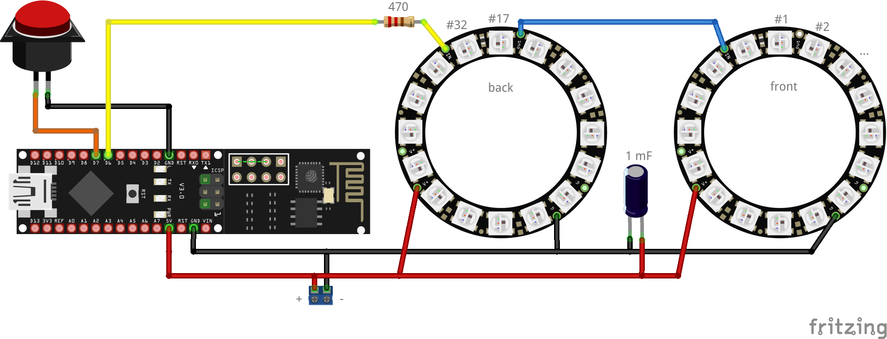

# lumibaer
Program for controlling a enhanced version of a Flötotto "Lumibär"

# Pimping the Lumibär

The Lumibär is ca. 40 cm high, formed like a bear and was originally was designed and developed by FLÖTOTTO (AFAICT) with a 12V halogen light. Nowadays, a LED-version is sold with a remote, which allows to set the color. 

As we wanted to have a rather unique version, I set out to create a rather nerdy version of it and am sharing my build here. 

Features:

* Uses an Arduino Nano with ESP8266 for WiFi connectivity (aka. Pretzelboard or NanoESP)
* Two Adafruit 16 Neopixel Rings for blinkenlights
* A button was added to enable a hands-on on/off and color selection.
* Supports various different modes:
    * **Single color mode**: acts as a normal light, with a color of your choosing.
	* **Sweep mode**: Transition between two colors.
	* **Lighthouse mode**: Turn your Lumibär into your favourite lighthouse by entering the ligth characteristic.
	* Optionally use different front and back colors.
	
As our Lumibär is opaque white, we refrain from supporting movements or using single LED patterns. 

# Circuitry

The parts used:

| Count | Part                | Comment                                                     |
|-------|---------------------|-------------------------------------------------------------|
| 1x    | NanoESP             | aka Pretzelboard, an Arduino Nano + ESP8266 on a single PCB |
| 2x    | 16 Neopixel Ring    | WS2812B, must fit through hole in bottom                    |
| 1x    | Button Switch       | color to your liking                                        |
| 1x    | 470Ω Resistor       | recommended by Adafruit in Neopixel tutorial                |
| 1x    | 1000 µF Capacitator | recommended by Adafruit in Neopixel tutorial                | 
| 1x    | Power Supply        | 5V output, at least 2A                                      |
| 5x    | Dupont terminals    | for connecting wires with the Arduino                       |

The parts are connected like this:

Notes:

* The power supply has to be connected to the "screw terminal" at the bottom of the sketch
* The capacitator prevents damaging the pixel through the first current onrush, when the device is powered.
* The resistor prevents damaging the first pixel by spikes on the data line
* Both previous measure have been recommended in the [Adafruit Neopixel Überguide](https://learn.adafruit.com/adafruit-neopixel-uberguide/basic-connections)
* LED numbering implies how to mount the pixel rings in the holder (see below - lowest numbered pixel at top position), if you mount them differently, you may have to change some code.

--- W A R N I N G ---

When programming the Lumibaer, first power the device using the power supply, then connect the USB. If all 32 LEDs are set to full white, each LED draws approximately 60 milliamps, so in total a current of 1.9A is drawn, which is a) more than the Arduino is able to deliver and which b) might be more than the USB port of your computer is able to sustain. You have been warned!

# Holder

The holder is 3D-printed from white PLA on a Flashforge Finder. You can find the design at [onshape.com](https://cad.onshape.com/documents/3edbe17af1ac7154b36a21e5/w/be9cdfd852b25ba857e68c3f/e/f320dc2e18de69cdc695974b), the STL is also part of this repository. 

Make sure that your printer's tolerances match your parts. In order to do this, print some prototypes to see, if:

1) The part fits on the metal rods holding it inside the Lumibär. Print the lowest 1cm of the model. 
2) The Neopixel Rings fit into the holder (you have to press slightly, to get them in and fixed). Print the top part of the model.

Only then print the full model

