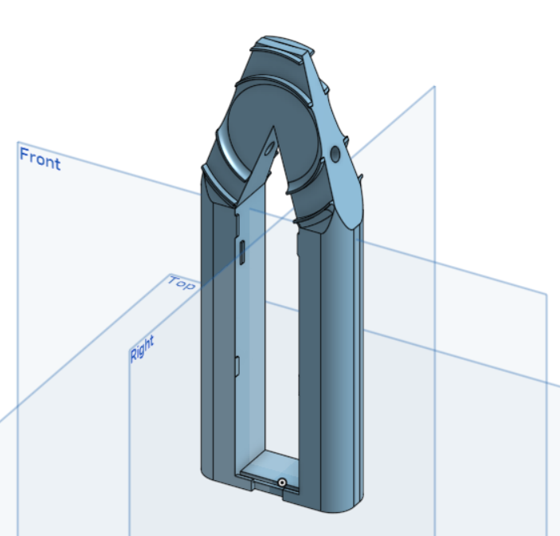

# lumibaer
Program for controlling a enhanced version of a Flötotto "Lumibär"

Status: in development

# Pimping the Lumibär

The Lumibär is ca. 40 cm high, formed like a bear and was originally was designed and developed by FLÖTOTTO (AFAICT) with a 12V halogen light. Nowadays, a LED-version is sold with a remote, which allows to set the color. 

As we wanted to have a rather unique version, I set out to create a rather nerdy version of it and am sharing my build here. 

Features:

* Uses an Arduino Nano with ESP8266 for WiFi connectivity (aka. Pretzelboard or NanoESP)
* Two Adafruit 16 Neopixel Rings for blinkenlights
* A button was added to enable a hands-on on/off and color selection.
* Supports various different modes:
    * **Single color mode**: acts as a normal light, with a color of your choosing.
	* **Sweep mode**: Transition between two colors.
	* **Lighthouse mode**: Turn your Lumibär into your favourite lighthouse by entering the ligth characteristic.
	* Optionally use different front and back colors.
	
As our Lumibär is opaque white, we refrain from supporting movements or using single LED patterns. 

# Circuitry

The parts used:

| Count | Part                | Comment                                                     |
|-------|---------------------|-------------------------------------------------------------|
| 1x    | NanoESP             | aka Pretzelboard, an Arduino Nano + ESP8266 on a single PCB |
| 2x    | 16 Neopixel Ring    | WS2812B, must fit through hole in bottom                    |
| 1x    | Button Switch       | color to your liking                                        |
| 1x    | 470Ω Resistor       | recommended by Adafruit in Neopixel tutorial                |
| 1x    | 1000 µF Capacitator | recommended by Adafruit in Neopixel tutorial                | 
| 1x    | Power Supply        | 5V output, at least 2A                                      |
| 5x    | Dupont terminals    | for connecting wires with the Arduino                       |
|       | cable binders       | fixing the power cable                                      |
|       | heat-shrink tubing  | avoid short circuits                                        |

The parts are connected like this:

Notes:

* The power supply has to be connected to the "screw terminal" at the bottom of the sketch
* The capacitator prevents damaging the pixel through the first current onrush, when the device is powered.
* The resistor prevents damaging the first pixel by spikes on the data line
* Both previous measure have been recommended in the [Adafruit Neopixel Überguide](https://learn.adafruit.com/adafruit-neopixel-uberguide/basic-connections)
* LED numbering implies how to mount the pixel rings in the holder (see below - lowest numbered pixel at top position), if you mount them differently, you may have to change some code.

--- W A R N I N G ---

When programming the Lumibaer, first power the device using the power supply, then connect the USB. If all 32 LEDs are set to full white, each LED draws approximately 60 milliamps, so in total a current of 1.9A is drawn, which is a) more than the Arduino is able to deliver and which b) might be more than the USB port of your computer is able to sustain. You have been warned!

# Holder

I 3D-printed the holder from white PLA on a Flashforge Finder. You can find the design at [onshape.com](https://cad.onshape.com/documents/3edbe17af1ac7154b36a21e5/w/be9cdfd852b25ba857e68c3f/e/f320dc2e18de69cdc695974b), the STL is also part of this repository. 

Make sure that your printer's tolerances match your parts. In order to do this, print some prototypes to see, if:

1) The part fits on the metal rods holding it inside the Lumibär. Print the lowest 1 cm of the model. 
2) The Neopixel Rings fit into the holder (you have to press slightly, to get them in and fixed). Print the top part of the model.
3) Also check that the NanoESP fits into the middle opening (see below)

Only then print the full model

If scaling the model does not work and you need to change the design, here are some hints:

* The size of the holes (where the metal rods go) is in "Skizze 1"
* The circles defining the shape, where the Neopixel-rings go are defined in "Skizze 7".

# Assembly Instructions

1) Press in the two Neopixel-rings onto the holder, so that all terminals are still accessible and you can solder the wires
2) Put in the Arduino into the holder by inserting the ESP end at the top between the two protrusions, then force press it into place between the two sides. You may want to use a cutter knive to remove some of the protusions, so that it's easier to insert the Arduino
3) Solder the resistor onto the back facing D_IN port
4) Cut the power cord (5V) coming from the power supply and solder the capacitator in between the wires. Watch for the correct polarity, if you're using an electrolyte capacitator
5) Solder further power cables onto the pins of the capacitator
6) Prevent short circuits by using heat-shrink tubing
7) Fix the power cord to one of the metal rods using cable binders. Fix it two times, leaving some extra wire for protection against pulling out the wire.
8) Solder the remaining wires to the neopixel rings, using the holes in the holder for routing wires.
9) Attach Dupont-terminals to the wires going to be connected to the Arduino
10) Connect the wires to the Arduino
11) Connect the Arduino to your PC using an USB cable

# Library Installations & Tests & Software Installation

Install the `Adafruit Neopixel` Library into your Arduinno IDE using the Tools -> Manage Libraries ... menu entry. For controlling the ESP part, download the [NanoESP library](https://iot.fkainka.de/library) (German site) or directly from [GitHub](https://github.com/FKainka/NanoESP).

In order to be able to upload sketches to the NanoESP, I had to choose Board "Arduino Nano" and Processor "ATmega328P (old bootloader)". You might need to choose a different setting, depending on how old your NanoESP is or wether your updated the firmware.

Then open and run the "strandtest" example from File -> Examples -> Adafruit NeoPixel. It should work out of the box. If it doesn't, check if the D_IN is connected to the right pin in the Arduino. You can then open the "test.ino" sketch from this project. It is basically a modified version of the strandtest program, which in addition switches the onboard LED, whenever the button switch is pressed and reorders the leds in the strip to make it easier to program later on. Check that the front ring is run through clockwise and back ring is run through conter clockwise. If that is not the case, check `pinTranslate()`.

If all is working well, define your network credentials in `credentials.h` and then compile and upload the `lumibaer.ino` sketch.

# Manual

## Initial State

When the Lumibär is connected to power, it tries to connect to the local WiFi, that you configured. If this is successful, the Lumibär flashes once in green. If it was unsuccessful, it flashes once in red. 

## Using the button

Pressing the button shortly switches the Lumibär on or off. The initial color is White (at full brightness). 
When switching on, hold the button and the Lumibär will cycle through colors. Just release the button, if the color is to your liking. After a color is selected, press the button shortly to switch the Lumibär on or off.

